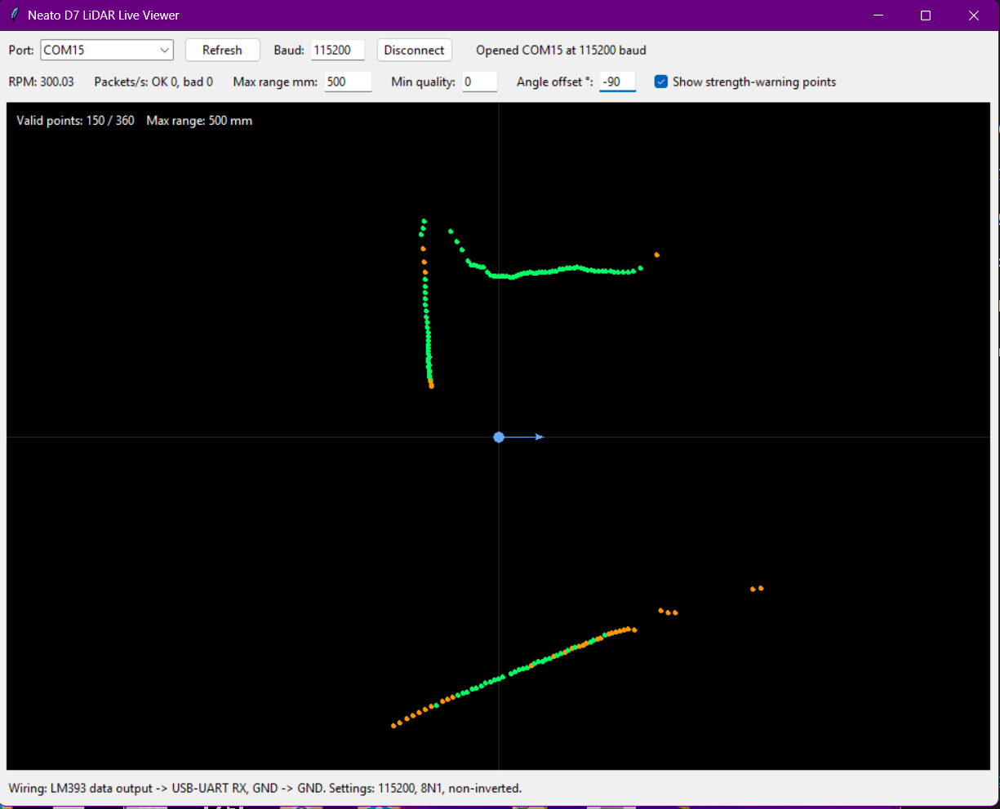

# Neato D7 LiDAR Reverse Engineering

This repository documents a working standalone wiring, tap point, and decoder for the LiDAR in a Neato Botvac D7 robot vacuum.

Neato app and cloud support is gone, which makes normal software rescue of these robots unlikely. The useful path is to reuse the hardware for an open robot vacuum platform. The D7 LiDAR is one of the most valuable parts, and this repo shows that it can be read as a standard serial scan stream.



## Current Finding

The D7 LiDAR scan data is available at the output of an LM393 comparator on the stationary side of the LiDAR electronics. In this setup the signal was probed at TP20 / DATA and read with a USB-UART adapter.

Confirmed serial settings:

```text
115200 baud
8 data bits
no parity
1 stop bit
non-inverted
LSB first
```

The packet format matches the classic Neato LDS packet structure:

```text
FA II SS SS D0 D0 Q0 Q0 D1 D1 Q1 Q1 D2 D2 Q2 Q2 D3 D3 Q3 Q3 CC CC
```

Each packet contains four 1-degree samples. Packet indexes `0xA0` through `0xF9` provide a complete 360-sample rotation.

## Wiring

Standalone wiring confirmed so far:

```text
Pin 2  = 5V logic / board power
Pin 3  = GND
Pin 11 = GND
Pin 17 = TP20 / DATA
Pin 18 = TP21, must be pulled to 5V
Pin 20 = LDS_M+
Pin 9  = LDS_M-
```

Notes:

- TP21 must be held high at 5V for standalone operation.
- TP21 also worked through a 4.7k resistor to 5V, so it appears to be a logic/control input rather than a heavy power rail.
- The LiDAR board logic is 5V.
- The LiDAR board logic draws about 330 mA.
- The LDS motor is driven around 5V to 6V depending on target RPM.
- The LDS motor draws about 25 mA at the tested operating point.
- About 300 RPM is the normal target speed, but packets were observed at lower speeds too.

Use the USB-UART adapter as a receiver only:

```text
Pin 17 / TP20 / DATA -> USB-UART RX
Pin 3 or 11 / GND    -> USB-UART GND
USB-UART TX          -> not connected
USB-UART VCC         -> not connected
```

Do not power the LiDAR from the USB-UART adapter. Check the signal voltage before connecting it to a UART input.

## Live Viewer

The repository includes a simple Python/Tkinter viewer:

```bash
python tools/neato_d7_live_viewer.py --port COM15
```

On Linux:

```bash
python tools/neato_d7_live_viewer.py --port /dev/ttyUSB0
```

Install the only Python dependency:

```bash
pip install -r requirements.txt
```

The viewer:

- reads the 115200 baud serial byte stream,
- validates classic Neato packet checksums,
- decodes distance, quality, invalid, and strength-warning flags,
- displays a live 2D point cloud,
- reports RPM and packet health.

## Why This Matters

This makes the D7 LiDAR practical to reuse in an open-source robot vacuum build. A future control stack can replace the original cloud-dependent electronics while keeping the valuable mechanical and sensing hardware:

- D7 chassis and dust path,
- drive wheels and motors,
- brush and vacuum motors,
- bumper and cliff sensors,
- dock contacts,
- LiDAR scan data.

The next software step is a ROS2 `sensor_msgs/msg/LaserScan` publisher that collects full rotations and publishes the D7 LiDAR as a standard 2D laser scanner.

## Documentation

Detailed notes are in:

- [docs/NEATO_D7_LIDAR_REVERSE_ENGINEERING.md](docs/NEATO_D7_LIDAR_REVERSE_ENGINEERING.md)

## Status

Working:

- standalone LiDAR power/control wiring
- TP20 / LM393 serial tap on pin 17
- TP21 enable/control high on pin 18
- 115200 8N1 decode
- classic LDS checksum validation
- live point-cloud viewer
- approximately 300 RPM scan rate

Not solved yet:

- ROS2 driver,
- integration into a full replacement robot control stack.
